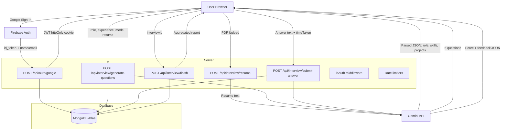

# PrepIQ — AI-Powered Mock Interview Platform

**Live Demo → [https://ai-interviewer-client-8o9j.onrender.com](https://ai-interviewer-client-8o9j.onrender.com)**

PrepIQ is a full-stack web application that simulates real job interviews using AI. Users upload their resume, select a role and interview mode, and answer questions spoken aloud by an AI interviewer. After each answer, Gemini evaluates the response and provides feedback. A detailed analytics report is generated at the end.

---

## Features

- **Resume Parser** — Upload a PDF resume; Gemini extracts role, experience, projects, and skills automatically
- **AI Question Generation** — 5 questions are generated per session, difficulty-scaled (easy → hard) based on role, experience, mode, and resume content
- **Voice-Based Interview** — Browser Speech Synthesis reads questions aloud; Web Speech API captures spoken answers
- **Two Interview Modes** — Technical and HR
- **Per-Answer AI Evaluation** — Each answer is scored on Confidence, Communication, and Correctness (0–10) by Gemini
- **Per-Question Timer** — Easy (60s), Medium (90s), Hard (120s); unanswered questions auto-submit at timeout
- **Post-Interview Analytics Report** — Overall score, skill breakdowns, question-wise feedback, and a performance trend chart
- **Interview History** — All past sessions with scores, modes, and completion status
- **Google OAuth** — Firebase handles the sign-in; a JWT cookie is issued by the server for all subsequent API calls
- **Rate Limiting** — Per-endpoint rate limiters to protect the AI routes and auth endpoints

---

## Tech Stack

| Layer | Technology |
|-------|-----------|
| Frontend | React 19, Vite, React Router v7 |
| State Management | Redux Toolkit |
| Animations | Framer Motion (motion/react) |
| Charts | Recharts, react-circular-progressbar |
| Styling | Vanilla CSS |
| Backend | Node.js, Express 5 |
| Database | MongoDB Atlas (Mongoose) |
| AI | Google Gemini 2.5 Flash (`@google/generative-ai`) |
| Authentication | Firebase Google OAuth + JWT (httpOnly cookie) |
| File Upload | Multer (disk storage) |
| PDF Parsing | pdfjs-dist |
| Rate Limiting | express-rate-limit |

---

## Architecture



---

## Folder Structure

```
ai-interview-prepper/
├── client/                         # React + Vite frontend
│   ├── public/
│   ├── src/
│   │   ├── assets/                 # Static images
│   │   ├── components/
│   │   │   ├── auth/               # AuthModal, AuthCard (Google sign-in)
│   │   │   ├── interview/          # Step1SetUp, Step2Interview, Step3Report, Timer
│   │   │   └── layout/             # Navbar, Footer
│   │   ├── pages/                  # Home, InterviewPage, InterviewHistory
│   │   ├── redux/                  # store.js, userSlice.js
│   │   └── utils/                  # constants.js, firebase.js
│   ├── index.html
│   ├── vite.config.js
│   └── package.json
│
├── server/                         # Node.js + Express backend
│   ├── config/                     # connectDB.js, generateToken.js
│   ├── controllers/                # auth, user, interview controllers
│   ├── middleware/                  # isAuth.js, multer.js, rateLimiter.js
│   ├── models/                     # user.model.js, interview.model.js
│   ├── public/                     # Temporary resume upload directory
│   ├── routes/                     # auth, user, interview routes
│   ├── services/                   # gemini.service.js
│   └── package.json
│
├── .gitignore
└── README.md
```

---

## Installation

### Prerequisites

- Node.js 18+
- MongoDB Atlas account
- Google Gemini API key ([Get one here](https://aistudio.google.com/app/apikey))
- Firebase project with Google Auth enabled ([Firebase Console](https://console.firebase.google.com))

### Clone

```bash
git clone https://github.com/karniSnehalKumar/ai_interviewer.git
cd ai_interviewer
```

### Server setup

```bash
cd server
npm install
cp .env.example .env
# Fill in your values (see Environment Variables section)
```

### Client setup

```bash
cd client
npm install
cp .env.example .env
# Fill in your values
```

---

## Environment Variables

### `server/.env`

```env
NODE_ENV=development
PORT=3000
MONGODB_URL=mongodb+srv://<user>:<password>@<cluster>.mongodb.net/<dbname>
JWT_SECRET=replace_with_a_strong_random_string_32_plus_chars
GEMINI_API_KEY=your_gemini_api_key
CLIENT_URL=http://localhost:5173
```

> Generate a JWT secret: `node -e "console.log(require('crypto').randomBytes(32).toString('hex'))"`

### `client/.env`

```env
VITE_FIREBASE_API_KEY=your_firebase_web_api_key
VITE_SERVER_URL=http://localhost:3000
```

> All Vite env vars must start with `VITE_` to be exposed in the browser.

---

## Running Locally

**Start the server:**
```bash
cd server
npm run dev
# Runs on http://localhost:3000
```

**Start the client (in a separate terminal):**
```bash
cd client
npm run dev
# Runs on http://localhost:5173
```

---

## Deployment

### Backend — Render

1. Create a new **Web Service** on [Render](https://render.com)
2. Connect your GitHub repository
3. Set **Root Directory** to `server`
4. **Build Command:** `npm install`
5. **Start Command:** `npm start`
6. Add all environment variables from `server/.env.example` in the Render dashboard
7. Set `NODE_ENV=production` and `CLIENT_URL=https://your-frontend.vercel.app`

> **Important:** Render does not provide persistent disk. Uploaded resume files are deleted after each deployment cycle — this is expected since `server/public/` only holds files temporarily during a single request.

### Frontend — Vercel

1. Import your repo on [Vercel](https://vercel.com)
2. Set **Root Directory** to `client`
3. **Build Command:** `npm run build`
4. **Output Directory:** `dist`
5. Add environment variables:
   - `VITE_FIREBASE_API_KEY`
   - `VITE_SERVER_URL` → your Render backend URL (no trailing slash)

---

## API Overview

All API routes are prefixed with `/api`. Protected routes require a valid JWT cookie (`token`).

### Auth — `/api/auth`

| Method | Endpoint | Auth | Description |
|--------|----------|------|-------------|
| POST | `/google` | ❌ | Sign in with Google; sets JWT cookie |
| GET | `/logout` | ❌ | Clears JWT cookie |

### User — `/api/user`

| Method | Endpoint | Auth | Description |
|--------|----------|------|-------------|
| GET | `/current-user` | ✅ | Returns authenticated user's profile |

### Interview — `/api/interview`

| Method | Endpoint | Auth | Rate Limit | Description |
|--------|----------|------|-----------|-------------|
| POST | `/resume` | ✅ | 5/10min | Upload PDF, parse with AI, return structured data |
| POST | `/generate-questions` | ✅ | 10/min | Generate 5 interview questions via Gemini |
| POST | `/submit-answer` | ✅ | 10/min | Evaluate one answer; returns feedback |
| POST | `/finish` | ✅ | General | Aggregate scores, mark interview complete |
| GET | `/get-interview` | ✅ | General | Fetch all past interviews for the user |

---

## Interview Flow

```
Step 1 (Setup)
  → Upload resume → AI parses it
  → Select mode (Technical / HR)
  → Generate 5 questions

Step 2 (Live Interview)
  → AI reads each question via TTS
  → User speaks or types answer
  → Timer counts down per question
  → On submit, Gemini evaluates answer in real time
  → AI reads feedback aloud

Step 3 (Report)
  → Overall score (avg of all question scores)
  → Confidence / Communication / Correctness breakdown
  → Performance trend chart (question-wise scores)
  → AI recommendation text
```

---

## Database Models

### `User`
```js
{
  name:  String,
  email: String (unique),
  timestamps: true
}
```

### `Interview`
```js
{
  userId:     ObjectId (ref: User),
  role:       String,
  experience: String,
  mode:       'HR' | 'Technical',
  resumeText: String,
  finalScore: Number,
  status:     'Incompleted' | 'completed',
  questions: [{
    question:      String,
    difficulty:    String,
    timeLimit:     Number,
    answer:        String,
    feedback:      String,
    score:         Number,
    confidence:    Number,
    communication: Number,
    correctness:   Number,
  }],
  timestamps: true
}
```

---

## Screenshots

> Add screenshots of the following screens after deployment:

| Screen | Description |
|--------|-------------|
| `Home` | Landing page with hero, features, and mode cards |
| `Setup` | Resume upload + role/mode selection form |
| `Interview` | Live interview with AI avatar, timer, speech input |
| `Report` | Score ring, skill bars, performance chart, Q&A breakdown |
| `History` | Past sessions grid with score badges |

---

## Future Improvements

- [ ] Persistent file storage (e.g. AWS S3) to support PDF resume access after upload
- [ ] Refresh token support for longer sessions without re-login
- [ ] Dark/light theme toggle
- [ ] Export interview report as PDF
- [ ] Support for additional languages via Web Speech API `lang` configuration
- [ ] Admin dashboard for usage analytics

---

## Contributing

1. Fork the repository
2. Create a feature branch: `git checkout -b feature/your-feature`
3. Commit your changes: `git commit -m "feat: your feature description"`
4. Push to your branch: `git push origin feature/your-feature`
5. Open a Pull Request

Please keep PRs focused on a single concern and include a clear description.

---

## License

This project is licensed under the **MIT License**.

---

<div align="center">
  Built by <a href="https://github.com/karniSnehalKumar">Snehal Kumar Karni</a>
</div>
